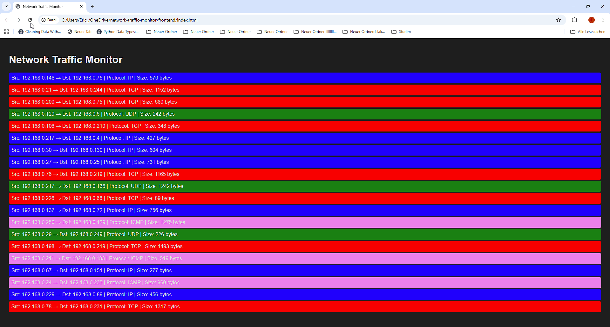

# Async Packet Sniffer with WebSocket Streaming

A small Python project that sniffs IP packets using `scapy` and streams packet data in real-time over WebSockets with a minimal browser frontend. Useful for learning async patterns, queues, and WebSocket servers in Python.

**Note:** The following demo uses simulated network traffic for illustration purposes. No real IP data is shown.


## Features

- Real-time packet sniffing on all available interfaces.
- Async WebSocket server to stream packet data to clients.
- Thread-safe coordination between packet sniffer and async tasks.
- Graceful shutdown on Ctrl+C.

## Backend

1. Ensure all dependencies are installed (see `requirements.txt`).
2. Start the Python backend:

```bash
python main.py
```
The backend runs the packet sniffer in a background thread and hosts a WebSocket server on ws://localhost:8765.


## Frontend

Frontend

Open index.html in your browser.

Important: Refresh the page once after starting the backend to establish the WebSocket connection.

The page displays real-time packet information:

Protocol

Size (bytes)

## Usage

1.Run the Python server(run backend):

```bash
python main.py
```

2.Open or refresh the frontend in a browser.

Watch the protocol and size of captured packets update live.

3.Ctrl+C stops both the sniffer and the WebSocket server gracefully.


# Notes

-Packets are processed from a thread-safe queue and streamed to connected clients.

-The server does not store packets long-term; once sent, they are discarded to avoid memory growth
